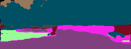
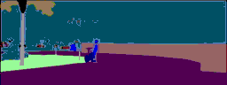

## GAN 
This is a GAN on a basis of U-Net
It is trained on Citylandscape dataset for object detection in a single pass

## Visulaizations
Model predicted:

Actual:

## Characteristics
Accuracy (pixels) -> 76%
Dice -> 26% (awfull for now)

it has 5 down and 5 up layers total of 10 layers:
[64, 128, 256, 512, 1024]
Its architecture is the most basic one.
